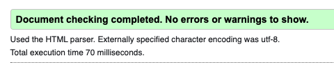

# Memory Game
## Interactive Frontend Development Milestone Project 2

The [Ocean Clean Up - Memory Game](https://kjluton.github.io/OceanClearUp_MemoryCardGame/) was built by Kirstyn Luton as part of the Interactive Frontend Development Milestone Project, Milestone 2 Project with Code Institute. The website presents a memory card game, where users can learn about the effects of rubbish in the ocean through playing the game.

Disclaimer: This website has been built for entertainment and education purposes. The website is build with HTML, CSS and Javascript with imported Bootstrap. The game is responsive for multiple screen types.

## [View live website in GitHub pages](https://kjluton.github.io/OceanClearUp_MemoryCardGame/)
---

# Table of Contents

1. [UX](#ux)
    - [Game goals](#game-goals)
    - [User goals](#user-goals)
        - [New user goals](##new-user-goals)
        - [Returning user goals](##returning-user-goals)
    - [User stories](#user-stories)
    - [Wireframes](#wireframes)
    - [Surface](#surface)
2. [Features](#features)
3. [Technologies Used](#technologies-used)
4. [Testing](#testing)
    - [Functionality testing](#functionality-testing)
    - [Code Validation](#code-validation)
    - [User stories testing](#user-stories-testing)
    - [Issues found during site development](#issues-found-during-site-development)
5. [Deployment](#deployment)
6. [Credits](#credits)

# UX

## Game goals
The goal of the website is to present an online memory game which is fun for the user to play. The game also intends to educate the player into the effects of the ocean on the enviroment.

### How to play
Once the game has loaded, the player has 50 seconds to find all the matching picture cards. 

The player must click on a turned over picture card to reveal the picture on the other side. The pictures on the front face will be of items that pollute the oceans. If the player can find its matching picture card, they will have found a match. When the player finds a match, the card will stay faced up. If they have not chosen two identical cards, the cards will automatically turn back around. 

To win the game the player must find all the matches before the time runs out.

## User goals
To play an online memory game and have fun whilst playing. 

## User stories

User 1: 
Jonny is an 8 year old who wants to play a fun game online. He has a lot of time to play games online and he plays a lot of games on his ipad. He also wants to be able to play games when he is in the back of the car going to school. 

User 2:
Jake is a 30 year old, male, georgraphy teacher looking for online educational games to share with his class to play at home. 

User 3: 
Lucy is a 12 year old learning about the ocean and effects of single use plastics. She gets bored in school easily and is looking for a fun way to learn about the enviroment. 

## Wireframes

### Game Page - Wireframe

## Surface

### Colours

The main colours used in this project were blues, greens and other colours associated with the ocean. The main colour codes are: 

Light text: #f0f8ff 
Start Button background: #004085
Small buttons: #8b008b 
Polluted areas: #044e156b

### Fonts

The fonts are installed from [Google Fonts](https://fonts.google.com/)

Main headers and buttons: https://fonts.google.com/specimen/Gluten#standard-styles 
Paragraph and small readble text: https://fonts.google.com/specimen/Dongle

### Images

https://www.cleanpng.com/png-hd-hyperreal-bubble-soap-bubbles-388/download-png.html

[Back to table of contents](#table-of-contents)

_______
# Features and Functions

The website game consists of 2 pages. 
## 1) A welcome page:
 

The welcome page has the following features: 

1. Welcomes the user to the game. 
2. Offers a customisable aspect to the game by asking the player their name. 
3. Bubbles moving up the page to provide atmosphere for the player. 
4. The ability to "pop" the bubbles on the screen. 
 

## 2) A game page 

The gamepage has the following features and functions: 

1.	Shuffle picture tiles on game start or restart. 
2.	Game should know how to handle matched and unmatched pictures.
3.	The game should show a countdown timer when the player presses ‘start game’.
4.	If the player wins the game, the timer stops and a congratulations message shows with time left score.
5. 	If timer runs out, alert message will display a "game over' message and include the number of matches the player found. 
6.	A restart button allows the current player to reset the game board, the countdown timer and the number of matches found.
7.  Ability to play on multiple screen sizes. 

## Future implementations

- When cards are matched, make them disappear instantly as though the game player is cleaning the ocean. 
- Add different levels of skill to appeal for older audiences and player growth. easy, medium, hard. This could be by either reducing the amount of time the player has to clean the board or by increasing the amount of squares/matches to be found on the board. 
- Adding music to the game to give it more atmostphere. Background music of bubbles and under water sounds. Then, add additional sounds when the player gets a correct match or incorrect match. 
- Adding additional educational elements to the page so the player can learn more about how they can help the enviroment, do their part to clean the oceans and reduce water pollution. 

[Back to table of contents](#table-of-contents)
_______

# Technologies Used

## Languages Used

* #### [HTML5](https://en.wikipedia.org/wiki/HTML5)
    HTML was used to build the website structure and overall layout. 

* #### [CSS3](https://en.wikipedia.org/wiki/CSS)
    CSS was used to style the website and build on the Bootstrap framework to customise the website to the owners brand. 

## Frameworks, Libraries and Programmes Used

* #### [Bootstrap](https://getbootstrap.com/)
    Bootstrap 5.0 was used to assist with a responsive design and basic structure of the website.  

* #### [JQuery](https://jquery.com/)
    JQuery was used with Bootstrap and aided the responsive and interactive elements of the site. 

* #### [Font Awesome](https://fontawesome.com/)
    Font Awesome was used to supply icons for the social links and 'Club Facilities' section. 

* #### [Google Fonts](https://fonts.google.com/) 
    Google Fonts were used to install the 'Bebas Neue' and 'Signika Negative' fonts which were used across the site. 

* #### [GitHub](https://github.com/)
    GitHub is used to store the project code. The code is pushed from GitPod to the GitHub respository. 

* #### [GitPod](https://www.gitpod.io/)
    Gitpod was used to write the code and the Git terminal was used for version control. The code was committed to Git and pushed to GitHub via the terminal. 

* #### [Balsamic](https://balsamiq.com/) 
    The Balsamic programme was used to build and develop the projects [Wireframes](#wireframes). 

* #### [Adobe Photoshop](https://www.photoshop.com/en) 
    Adobe Photoshop was used to create the logo, edit images and resize images for the website. 

[Back to table of contents](#table-of-contents)
_______

# Testing

### Functionality Testing

Throughout the process I continuously tested the gane functionality and page layouts by using the chrome inspect and development tools. 

### User Stories Testing

User 1: 
Testing as user 1 showed that the game would be suitable for this user. Further development may need to happen to ensure wording is clear for a child of 8. Additional images would be useful to keep younger children engaged. Game works on a tablet screen to this user can play the game on the move. 

User 2:
User 2 found this game simple and easy to use. The game is easily shared with the children and he is happy with the content that is provided. Would like to see further educational sources on teh game site so the children can continue to learn. Would also like to see different ability levels to ensure all children in the class are tested according to their ability.

User 3: 
The game works well for user 3. It's a fun engaging game that is also educational. Would like to see extra difficulty levels so they don't get bored.

### Code Validation

## CSS Validation

Due to using the Bootsrap plugin, I used the direct code tool to validate my CSS. 

    

     

## HTML Validation

## JShint Validation

There are 25 functions in this file.
Function with the largest signature take 1 arguments, while the median is 0.
Largest function has 9 statements in it, while the median is 2.
The most complex function has a cyclomatic complexity value of 3 while the median is 1.
9 warnings due to Jquery coding.

### Issues Found During Game Development

- Getting tiles squares to sit nicely on a grid and have one card overlay the other. 
- Allowing game grid to sit nicely on a mobile screen. When played on a mobile, the grid would fall off the screen. To fix this a media query was placed on the grid template columns and the size of the tiles. 
- If tiles were flipped too fast it thought two incorrect tiles are the same and overites script. 
- Setting up hover element in javascript meant that all tiles were highlighted when 'mouseon'. Decided to create this effect with css hover function following advice from mentor.
- Working out how to stop timer - when number of matches === (tiles.length/2), stop timer. Doesn't recognise "score" as "8" so it is always false. Created a variable of 'score' which could be === 8 instead of trying to read the text value of the span. 

[Back to table of contents](#table-of-contents)
_______
# Deployment

The project was deployed to GitHub Pages. Gitpod was used as the development workspace. I committed and logged all changes to the project, using the git command control system. At the end of each session, I used the git push command in the GitPod terminal to push all changes to the GitHub repository. 

To deploy the project I had to:

* Log in to GitHub and click on repository to deploy (https://kjluton.github.io/OceanClearUp_MemoryCardGame)
* Select 'Settings' and find the ‘Pages’ section at the bottom of the vertical menu, on the left hand side.
* From 'source', click where it says 'none' and update to 'branch: Master'. 
* Click 'save' and refresh your page to confirm deployment.  

To run locally: 
* Log into GitHub and click on the repository to download (https://kjluton.github.io/OceanClearUp_MemoryCardGame)
* Select 'code' and click 'Download" on the Zip File. 
* Once you download the file, you can extract it and use it in your local environment. 

[Back to table of contents](#table-of-contents)
_______
# Credits

## Content

The content for the game was written by myself and facts were taken from: https://www.conservation.org/stories/ocean-pollution-11-facts-you-need-to-know

## Media

#### Images: 

The images of the tiles were created by myself in Adobe Photoshop. I used the following assets to create these images:
- [Bin Bag](https://imgbin.com/png/BJ4GdYBy/bin-bag-plastic-bag-rubbish-bins-amp-waste-paper-baskets-png#)
- [Fishing net](https://www.subpng.com/png-4wsq1u/)
- [Plastic bottle](http://clipart-library.com/clipart/422887.html)
- [Oil barrel](https://www.vectorstock.com/royalty-free-vector/metal-barrel-with-oil-icon-cartoon-style-vector-12048361)
- [Food carton](https://www.pikpng.com/downpngs/owwoJo_1528906718-clipart-of-orange-juice-clip-art-orange/) 
- [Plastic straws](https://www.pngitem.com/download/xwJwob_transparent-plastic-cup-clipart-transparent-background-straw-clipart/)
- [Cigarette end](https://pixabay.com/users/clker-free-vector-images-3736/)
- [Glass bottle](https://www.clipartmax.com/middle/m2i8b1i8A0b1i8A0_coca-cola-fizzy-drinks-diet-coke-clip-art-color-in-coke-bottle/)
- [Dead Fish](https://www.vhv.rs/viewpic/hiwhwoh_cartoon-fish-bones-clipart-png-download-draw-a/)

[Bubble image is from here](https://www.cleanpng.com/png-hd-hyperreal-bubble-soap-bubbles-388/download-png.html)
[Main background is from here](https://www.wallpapertip.com/wpic/mTwwx_under-sea-wallpaper-free-under-the-sea-background/)

[Favicon image](https://www.flaticon.com/free-icons/fish")
  
#### README.md File Assistance

#### Code:

Durignt he project I used the following courses to assist with code writing and developing my understanding of functions:

- For assistance with "Show" and "Hide" features, I used: https://www.w3schools.com/howto/howto_js_toggle_hide_show.asp 
- To assit with fitting the background to cover the HMTL: https://css-tricks.com/perfect-full-page-background-image/
- To assist in animating the bubbles: https://stackoverflow.com/questions/16797187/css-animation-moving-an-image-up-the-screen-with-keyframes 
- The following youtube videos helped me with ideas on how to structure the memory card game: 
         - https://www.youtube.com/watch?v=28VfzEiJgy4 
         - https://www.youtube.com/watch?v=3uuQ3g92oPQ 
- The following site also helped me with a memory card game structure: https://scotch.io/tutorials/how-to-build-a-memory-matching-game-in-javascript#toc-what-is-the-memory-game 
- For assistance with 'mouse over' features, I used: https://www.w3schools.com/jsref/event_onmouseover.asp
- For assistance with the countdown feature, I used: https://stackoverflow.com/questions/31106189/create-a-simple-10-second-countdown 

# Acknowledgements

Thank you to my mentor Antonija Šimić for their support and guidance during the project development. 
 
Thank you to my family and friends, especilly Matej Navara, who tested the site and provided valuable feedback. 

[Back to Table of contents](#table-of-contents)

